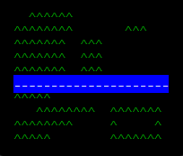
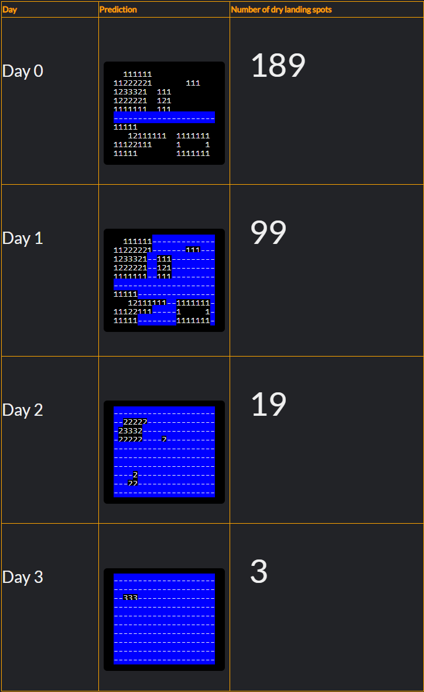

# Bird Mountain - the river

```yaml
Level : 4 kyu
```

# Instructions

Background

A high flying bird is able to estimate the contours of the ground below.

He sees hills and valleys, he sees plains and mountains.

(But you already know all this because you've solved my [Bird Mountain](https://www.codewars.com/kata/bird-mountain) Kata)

<hr>

But this time our protagonist bird also sees a RIVER.

Not only that, but he sees that the river is rising rapidly, so much so that in a few days it threatens to inundate the surrounding land.

And all this is very important to the bird because he cannot land on water!

Kata Task
The bird quickly calculates how much ground will remain dry as the water rises.

Can you?

Output
- A list of how many dry landing spots there are for the next 3 days only (include day 0)

Notes
- The ground is always supplied as a rectangular grid
- The normal river is at level -0.5. It is rising at 1 unit per day
- Sometimes there isn't any river at all, so you better account for those cases too!

Example
The birds-eye view



The bird-brain calculations



Dry ground = [189, 99, 19, 3]

Series
- [Bird Mountain](https://www.codewars.com/kata/bird-mountain) 

- [Bird Mountain - the river](https://www.codewars.com/kata/5c2fd9188e358f301f5f7a7b) 

Java kata [link](https://www.codewars.com/kata/5c2fd9188e358f301f5f7a7b/train/java) 