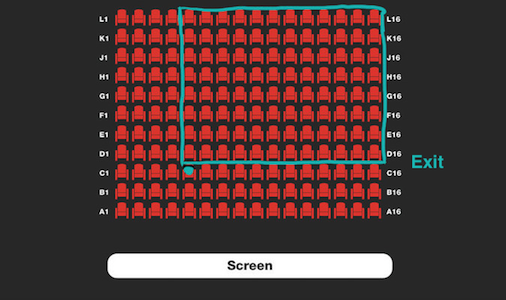

# Simple Fun #1: Seats in Theater

```yaml
Level : 8 kyu
```


# Instructions
Task
Your friend advised you to see a new performance in the most popular theater in the city.
He knows a lot about art and his advice is usually good, but not this time: the performance turned out to be awfully dull.
It's so bad you want to sneak out, which is quite simple, especially since the exit is located right behind your row to the left.
All you need to do is climb over your seat and make your way to the exit.

The main problem is your shyness: you're afraid that you'll end up blocking the view (even if only for a couple of seconds) of all the people who sit behind you and in your column or the columns to your left.
To gain some courage, you decide to calculate the number of such people and see if you can possibly make it to the exit without disturbing too many people.

Given the total number of rows and columns in the theater (nRows and nCols, respectively), and the row and column you're sitting in, return the number of people who sit strictly behind you and in your column or to the left, assuming all seats are occupied.


Example
For nCols = 16, nRows = 11, col = 5 and row = 3, the output should be
```yaml
Theater.seats nCols nRows col row == 96
```

Here is what the theater looks like:



Input/Output
[input] integer nCols

An integer, the number of theater's columns.

Constraints: 1 ≤ nCols ≤ 1000.

[input] integer nRows

An integer, the number of theater's rows.

Constraints: 1 ≤ nRows ≤ 1000.

[input] integer col

An integer, the column number of your own seat (with the rightmost column having index 1).

Constraints: 1 ≤ col ≤ nCols.

[input] integer row

An integer, the row number of your own seat (with the front row having index 1).

Constraints: 1 ≤ row ≤ nRows.

[output] an integer
The number of people who sit strictly behind you and in your column or to the left.


You can find this SquareNSum by [link](https://www.codewars.com/kata/588417e576933b0ec9000045/train/scala)